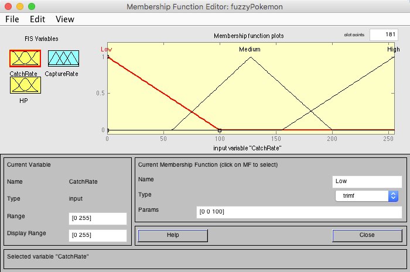
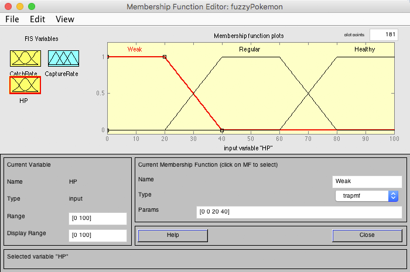
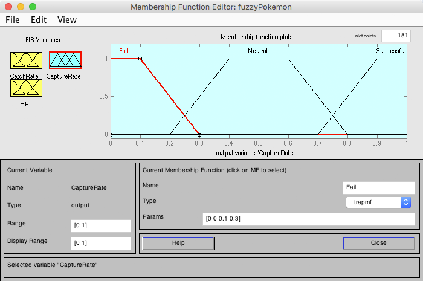

<strong>
CENTRO FEDERAL DE EDUCAÇÃO TECNOLÓGICA DE MINAS GERAIS 
ENGENHARIA DE COMPUTAÇÃO 
LABORATÓRIO DE INTELIGÊNCIA ARTIFICIAL 
Prof. Flávio Cruzeiro
</strong>

### TRABALHO PRÁTICO 4  Lógica _Fuzzy_, _Perceptron_ & RNA, e WEKA
<strong>
por Pedro Felipe Froes e Saulo Antunes
</strong>

## Parte 1: Lógica _Fuzzy_
A lógica _fuzzy_ (ou lógica difusa) é uma lógica que procura modelar o racicíonio implementando conjuntos _fuzzy_, que mapeiam o grau de pertinência de uma variável a esse conjunto. Ao contrário da lógica booleana tradicional, cujos valores de falso e verdadeiro são 0 e 1, respectivamente, na lógica _fuzzy_ uma variável pode assumir qualquer valor escalar entre 0 e 1 através do seu grau de pertinência ao conjunto.

A seguir, foram modelados dois problemas utilizando a lógica _fuzzy_ a fim de exemplificar possíveis aplicações para essa lógica.

#### Problema 1: Capturando um Pokémon

Na franquia Pokémon, o processo de captura de um Pokémon envolve principalmente a _catch rate_ do mesmo (uma taxa de captura, única para cada Pokémon) e o quão enfraquecido ele se encontra (quanto menor for seu HP, mais enfraquecido ele está). Combinadas, elas influenciam _capture rate_, ou seja, na chance de capturar ou não o Pokémon.

A _catch rate_ possui intervalo de 0 a 255, com o intervalo de 0 a 100 sendo considerada baixa, 50 a 200 média, e 150 a 255, alta.

###### _Catch rate_ do Pokémon

Já o HP do Pokémon foi modelado no intervalo de 0 a 100, onde de 0 a 40 o Pokémon está fraco, 20 a 80 representa um estado regular, e de 60 a 100 o Pokémon está saudável.

###### HP do Pokémon

A saída _capture rate_ é dada em porcentagem e modelada analisando as duas variáveis de entrada aplicadas no conjunto de regras. De 0 a 30% a chance de captura está mais inclinada para a falha, de 20% a 80% representa uma chance neutra, e acima de 70% há uma chance alta de capturar o Pokémon em questão.

###### _Capture rate_ do Pokémon

O conjunto de regras que combina as variáveis de entrada e saída é:

* se **_catch rate_ é _high_** e **_HP_ é _weak_**, então **_capture rate_ é _successful_**;
* se **_catch rate_ é _high_** e **_HP_ é _regular_**, então **_capture rate_ é _successful_**;
* se **_catch rate_ é _high_** e **_HP_ é _healthy_**, então **_capture rate_ é _neutral_**;
* se **_catch rate_ é _medium_** e **_HP_ é _weak_**, então **_capture rate_ é _successful_**;
* se **_catch rate_ é _medium_** e **_HP_ é _regular_**, então **_capture rate_ é _neutral_**;
* se **_catch rate_ é _medium_** e **_HP_ é _healthy_**, então **_capture rate_ é _fail_**;
* se **_catch rate_ é _low_** e **_HP_ é _weak_**, então **_capture rate_ é _neutral_**;
* se **_catch rate_ é _low_** e **_HP_ é _regular_**, então **_capture rate_ é _fail_**;
* se **_catch rate_ é _low_** e **_HP_ é _healthy_**, então **_capture rate_ é _fail_**.

###### Gráfico de superfície

Além do gráfico de superfície acima, é possível visualizar algumas possíveis situações diferentes para as variáveis de entradas e suas respectivas saídas. Para exemplificar, a entrada do HP foi deixada em 50, enquanto variou-se a _catch rate_ do Pokémon.

###### _catch rate_ baixa, HP médio

###### _catch rate_ média, HP médio

###### _catch rate_ alta, HP médio

#### Problema 2:

## Parte 2: _Perceptron_ & RNA

Perceptron são redes neurais simples constituídas através de uma camada de entrada, onde cada entrada possui um peso, e uma única camada de saída, que corresponde ao valor da soma do produto entre cada entrada e seu respectivo peso dentro da rede.

Será implementado um _perceptron_ de três entradas e duas saídas para as funções `E` e `OU` através da _toolbox_ RNA do MATLAB, com o _perceptron_ sendo treinado através da Regra Delta. A rede neural produz uma saída assim que um padrão é apresentado a ela, sendo que há o ajuste dos pesos para que o resultado esperado seja atingido.

Após definir o _perceptron_ através do comando `newp`, deve definir-se os _inputs_ de entrada e saída. Posteriormente, inicializa-se a rede através do comando `sim` e define-se os padrões de treinamento, e, finalmente, deve-se treinar a rede com o comando `train`.

Os comandos para a construção das duas regras podem ser conferidos abaixo:

#### Regra `E`

#### Regra `OU`

## Parte 3: WEKA

