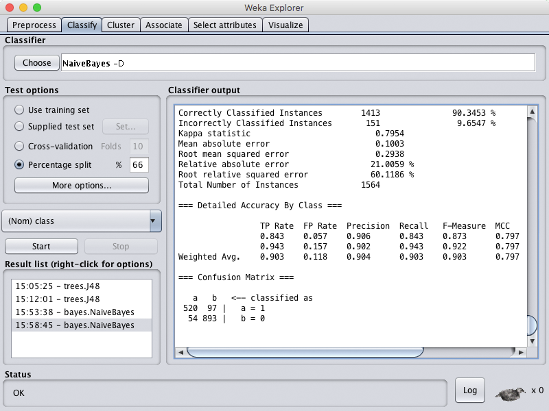

<strong>
CENTRO FEDERAL DE EDUCAÇÃO TECNOLÓGICA DE MINAS GERAIS 
ENGENHARIA DE COMPUTAÇÃO 
LABORATÓRIO DE INTELIGÊNCIA ARTIFICIAL 
Prof. Flávio Cruzeiro
</strong>

### TRABALHO PRÁTICO 4  Lógica _Fuzzy_, _Perceptron_ e RNA & Weka
<strong>
por Pedro Felipe Froes e Saulo Antunes
</strong>

## Parte 1: Lógica _Fuzzy_
A lógica _fuzzy_ (ou lógica difusa) é uma lógica que procura modelar o racicíonio implementando conjuntos _fuzzy_, que mapeiam o grau de pertinência de uma variável a esse conjunto. Ao contrário da lógica booleana tradicional, cujos valores de falso e verdadeiro são 0 e 1, respectivamente, na lógica _fuzzy_ uma variável pode assumir qualquer valor escalar entre 0 e 1 através do seu grau de pertinência ao conjunto.

A seguir, foram modelados dois problemas utilizando a lógica _fuzzy_ a fim de exemplificar possíveis aplicações para essa lógica.

#### Problema 1: Capturando um Pokémon

Na franquia Pokémon, o processo de captura de um Pokémon envolve principalmente a _catch rate_ do mesmo (uma taxa de captura, única para cada Pokémon) e o quão enfraquecido ele se encontra (quanto menor for seu HP, mais enfraquecido ele está). Combinadas, elas influenciam _capture rate_, ou seja, na chance de capturar ou não o Pokémon.

A _catch rate_ possui intervalo de 0 a 255, com o intervalo de 0 a 100 sendo considerada baixa, 50 a 200 média, e 150 a 255, alta.

###### _Catch rate_ do Pokémon

Já o HP do Pokémon foi modelado no intervalo de 0 a 100, onde de 0 a 40 o Pokémon está fraco, 20 a 80 representa um estado regular, e de 60 a 100 o Pokémon está saudável.

###### HP do Pokémon

A saída _capture rate_ é dada em porcentagem e modelada analisando as duas variáveis de entrada aplicadas no conjunto de regras. De 0 a 30% a chance de captura está mais inclinada para a falha, de 20% a 80% representa uma chance neutra, e acima de 70% há uma chance alta de capturar o Pokémon em questão.

###### _Capture rate_ do Pokémon

O conjunto de regras que combina as variáveis de entrada e saída é:

* se **_catch rate_ é _high_** e **_HP_ é _weak_**, então **_capture rate_ é _successful_**;
* se **_catch rate_ é _high_** e **_HP_ é _regular_**, então **_capture rate_ é _successful_**;
* se **_catch rate_ é _high_** e **_HP_ é _healthy_**, então **_capture rate_ é _neutral_**;
* se **_catch rate_ é _medium_** e **_HP_ é _weak_**, então **_capture rate_ é _successful_**;
* se **_catch rate_ é _medium_** e **_HP_ é _regular_**, então **_capture rate_ é _neutral_**;
* se **_catch rate_ é _medium_** e **_HP_ é _healthy_**, então **_capture rate_ é _fail_**;
* se **_catch rate_ é _low_** e **_HP_ é _weak_**, então **_capture rate_ é _neutral_**;
* se **_catch rate_ é _low_** e **_HP_ é _regular_**, então **_capture rate_ é _fail_**;
* se **_catch rate_ é _low_** e **_HP_ é _healthy_**, então **_capture rate_ é _fail_**.

###### Gráfico de superfície

Além do gráfico de superfície acima, é possível visualizar algumas possíveis situações diferentes para as variáveis de entradas e suas respectivas saídas. Para exemplificar, a entrada do HP foi deixada em 50, enquanto variou-se a _catch rate_ do Pokémon.

###### _catch rate_ baixa, HP médio

###### _catch rate_ média, HP médio

###### _catch rate_ alta, HP médio

#### Problema 2: Maratona de Programação

No treinamento para a **Maratona de Programação**, os alunos se deparam com uma grande quantidade de problemas disponíveis para serem resolvidos. Existem problemas antigos, que já estão disponíveis há anos, e também há sempre novos problemas disponíveis.

Para ajudar a escolha dos problemas, foi modelada uma lógica fuzzy que permite identificar a dificuldade do problema de acordo com o **tempo de publicação** e a **quantidade de soluções** submetidas para um problema.

##### Tempo de Publicação

A primeira variável está relacionada ao tempo de publicação (em meses) que o problema possui.

###### Tempo de Publicação *(em meses)*

##### Soluções Submetidas

A segunda variável está relacionada a quantidade de soluções submetidas e aceitas que um problema possui.

###### Soluções Submetidas

##### Dificuldade

A saída relaciona um nível de dificuldade para o problema.

###### Dificuldade do Problema

##### Regras

Abaixo, o conjunto de regras fuzzy utilizado:

* se **Tempo de Publicação é Recente** e **Quantidade de Soluções é Médio**, então **Dificuldade não é Difícil**;
* se **Tempo de Publicação é Recente** e **Quantidade de Soluções é Muito**, então **Dificuldade é Fácil**;
* se **Tempo de Publicação é Médio** e **Quantidade de Soluções é Pouco**, então **Dificuldade não é Fácil**;
* se **Tempo de Publicação é Médio** e **Quantidade de Soluções é Médio**, então **Dificuldade é Médio**;
* se **Tempo de Publicação é Médio** e **Quantidade de Soluções é Muito**, então **Dificuldade é Fácil**;
* se **Tempo de Publicação é Antigo** e **Quantidade de Soluções é Pouco**, então **Dificuldade é Difícil**;
* se **Tempo de Publicação é Antigo** e **Quantidade de Soluções é Médio**, então **Dificuldade não Difícil**;
* se **Tempo de Publicação é Antigo** e **Quantidade de Soluções é Muito**, então **Dificuldade não é Difícil**.

Podemos ver através de algumas simulações, que um problema, mesmo que com o mesmo número de soluções, resulta em diferentes níveis de dificuldade com a variação do seu tempo de publicação, como era de se esperar.

###### 100 soluções em 6 meses

###### 100 soluções em 12 meses

##### Gráfico de Superfície
O gráfico de superfície proporciona uma visão bastante intuitiva de como as variáveis **tempo de publicação** e **soluções submetidas** influenciam na dificuldade do problema.

##### Gráfico de Superfície

## Parte 2: _Perceptron_ & RNA

_Perceptron_ é uma rede neural simples constituída através de uma camada de entrada, onde cada entrada possui um peso, e uma única camada de saída, que corresponde ao valor da soma do produto entre cada entrada e seu respectivo peso dentro da rede.

Será implementado um _perceptron_ de três entradas e duas saídas para as funções `E` e `OU` através da _toolbox_ RNA do MATLAB, com o _perceptron_ sendo treinado através da Regra Delta. A rede neural produz uma saída assim que um padrão é apresentado a ela, sendo que há o ajuste dos pesos para que o resultado esperado seja atingido.

Após definir o _perceptron_ através do comando `newp`, deve definir-se os _inputs_ de entrada e saída. Posteriormente, inicializa-se a rede através do comando `sim` e define-se os padrões de treinamento, e, finalmente, deve-se treinar a rede com o comando `train`.

Os comandos para a construção das duas regras podem ser conferidos abaixo:

#### Regra `E`

#### Regra `OU`

## Parte 3: Weka

A ferramenta Weka foi desenvolvida na Universidade de Waikato, Nova Zelândia, e permite o acompanhamento de alguns algoritmos de aprendizagem de máquina. Uma de suas possíveis aplicações é na construção de um filtro de _spans_ para uma caixa de entrada de um email. Para isso, foi utilizada a _spambase_, uma base de dados produzida pelo grupo de pesquisa do Hewlett-Packyard Labs, onde pouco menos que a metade dos 4600 emails são _spans_ (1813 _spans_, 2788 não _spans_).

A Weka acompanhou três tipos de algoritmos para a construção do filtro: uma árvore de decisão, um _bayes_ ingênuo e redes neurais, e o resultado obtido com cada um deles é exibido a seguir.

#### Árvore de Decisão

###### Árvore de decisão sem `reduceErrorPruning`

`Size of the tree : 207`

`Correctly Classified Instances 1442 92.1995 %`

###### Árvore de decisão com `reduceErrorPruning`

`Size of the tree : 161`

`Correctly Classified Instances 1446 92.4552 %`

Rodando o algoritmo `trees/J48` sem `reduceErrorPruning` ativado, o tamanho da árvore obtida foi de 207, com 104 nós folhas, e a taxa de acerto é de 92.20%. Tornando a opção `true`, tem-se uma árvore com tamanho 161 e número de nós 81, com taxa de acerto de 92.46%.

O algoritmo com `reduceErrorPruning` gera uma árvore aproximadamente 23% menor que o algoritmo sem a poda, o que é uma mudança significativa. A taxa de acerto permanece pouco alterada porque a poda remove seções da árvore que não contribuem muito para classificar se é ou não _spam_, evitando o sobreajuste do modelo, o que não afeta a taxa de acerto quantitativamente.

#### _Bayes_ ingênuo

###### Algoritmo bayesiano simples sem `useSupervisedDiscretization`

`Correctly Classified Instances 1220 78.0051 %`

###### Algoritmo bayesiano simples com `useSupervisedDiscretization`

`Correctly Classified Instances 1413 90.3453 %`

Para o algoritmo bayesiano simples sem `useSupervisedDiscretization` ativado, obteve-se uma taxa de acerto de 78.01%, enquanto ativando a opção, obteve-se 90.36% de acerto, uma mudança significativa em relação ao anterior graças à alta sensibilidade do _bayers_ ingênuo às dimensões dos dados, que são alteradas quando ocorre a discretização e posterior contagem.

#### Redes neurais

Primeiramente, foram treinadas 6 redes neurais diferentes, combinando os valores de `learning rate` de 0.1 e 0.3 e `hidden layers` de 5, 10 e 20, cujos resultados podem ser vistos na tabela a seguir. Os valores de `traning time = 100`, `reset = false` e restantes foram mantidos constantes.

| parâmetros | tempo  | taxa de acerto | 
| --- | :---: | :---: |
| `learning rate = 0.1` `hidden layers = 5` | 3.19 s | 89.3223% |
| `learning rate = 0.1` `hidden layers = 10` | 5.4 s | 88.2353% |
| `learning rate = 0.1` `hidden layers = 20` | 10.42 s | 88.8107% |
| `learning rate = 0.3` `hidden layers = 5` | 2.87 s | 85.8696% |
| `learning rate = 0.3` `hidden layers = 10` | 5.29 s | 89.5141% |
| `learning rate = 0.3` `hidden layers = 20` | 9.95 s | 88.8107% |

###### Redes neurais com variações em `learning rate` e `hidden layers`

A rede com a melhor taxa de acerto é a de `learning rate = 0.3` e `hidden layers = 10` com o valor de 89.51%. Uma camada escondida geralmente é suficiente, dado que o valor para duas camadas é idêntico ao com uma, excento quando os dados não são contínuos. Portanto, é possível que haja uma descontinuidade nos dados devido aos resultados piores para tanto com mais e menos camadas escondidas.

A seguir, foram realizados simulações com `training time = 300` e `hidden layers = 10`, variando o `learning rate` em 0.1 e 0.3, com os resultados mostrados nas figuras a seguir.

###### Rede neural com  `training time = 300`, `hidden layers = 10` e `learning rate = 0.1`

`Time taken to build model: 16.05 seconds`

`Correctly Classified Instances 1395 89.1944 %`

###### Rede neural com  `training time = 300`, `hidden layers = 10` e `learning rate = 0.3`

`Time taken to build model: 16.86 seconds`

`Correctly Classified Instances 1409 90.0895 %`

Aumentar o tempo de treinamento de 100 para 300 de fato melhorou as taxas de acertos para ambas taxas de aprendizado. No entanto, não há garantia de que isso sempre ocorra, dado que pode ocorrer o problema de _overtraining_ em que a rede se especializa em um determinado conjunto de dados e perde a capacidade de generalizar o conjunto como um todo.

Para uma rede com `training time = 300`, `hidden layers = 5` e `learning rate = 0.3`, obteve-se a seguinte resposta:

###### Rede neural com  `training time = 300`, `hidden layers = 10` e `learning rate = 0.3`

`Time taken to build model: 8.76 seconds`

`Correctly Classified Instances 1397 89.3223 %`

De forma análoga aos resultados anteriores, a taxa de acerto foi, de fato, maior para um tempo de treinamento de 300 em relação ao tempo 100 mostrado anteriormente.

Finalmente, foram feitos múltiplos experimentos considerando os valores iniciais de `learning rate = 0.1`, `hidden layers = 1` e `training time = 100`. Com esses valores, foram obtidos os resultados:

`Time taken to build model: 0.96 seconds`

`Correctly Classified Instances 1393 89.0665 %`

A partir desses valores, foram realizados variando `learning rate`, `hidden layers` e `training time`, um de cada vez, cujos resultados são mostrados nas tabelas a seguir.

| parâmetros | tempo  | taxa de acerto | 
| --- | :---: | :---: |
| `learning rate = 0.2` `hidden layers = 1` `training time = 100` | 0.98 s | 89.9616% |
| `learning rate = 0.5` `hidden layers = 1` `training time = 100` | 0.95 s | 90.6010% |
| `learning rate = 1` `hidden layers = 1` `training time = 100` | 0.94 s | 60.7417% |

###### Rede neural com `hidden layers = 1` e `training time = 100`, variando `learning rate` em `0.2`, `0.5` e `1`

| parâmetros | tempo  | taxa de acerto | 
| --- | :---: | :---: |
| `learning rate = 0.1` `hidden layers = 2` `training time = 100` | 1.43 s | 89.3862% |
| `learning rate = 0.1` `hidden layers = 5` `training time = 100` | 2.95 s | 89.3223% |
| `learning rate = 0.1` `hidden layers = 10` `training time = 100` | 5.45 s | 88.2353% |

###### Rede neural com `learning rate = 0.1` e `training time = 100`, variando `hidden layers` em `1`, `2` e `5`

| parâmetros | tempo  | taxa de acerto | 
| --- | :---: | :---: |
| `learning rate = 0.1` `hidden layers = 1` `training time = 200` | 1.95 s | 88.9386% |
| `learning rate = 0.1` `hidden layers = 1` `training time = 500` | 4.73 s | 89.7059% |
| `learning rate = 0.1` `hidden layers = 1` `training time = 1000` | 9.12 s | 90.7928% |

###### Rede neural com `learning rate = 0.1` e `hidden layers = 1`, variando `training time` em `200`, `500` e `1000`

A taxa de aprendizagem possui uma grande influencia nos dados, dado que quando foi variada, causou a disparidade entre os três primeiros (onde só foi aumentando) e a última variação (onde houve uma drástica perda de aproximadamente 30% de acerto). Já as camadas escondidas não tiveram uma grande variação entre os resutaldos, bem como a variação do tempo de aprendizagem, que diminui ao passar o tempo de 100 para 200, mas só aumenta posteriormente. Uma causa para a randomicidade aparente dos resultados é a descontinuidade dos dados, que afetou o resultado anteriormente e pode estar atrelada à essa característica aleatória.